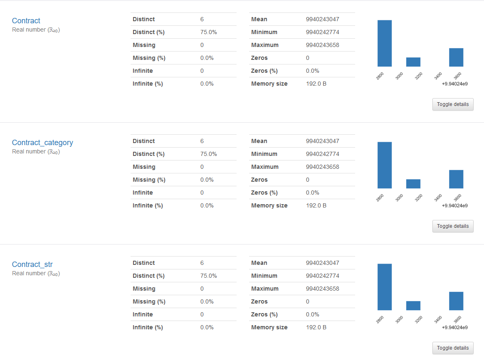

# Pandas-Profiling-issue-recreation
A sample notebook recreating pandas-profiling issue

# Issue
Pandas-Profiling is not considering the changed datatypes of the columns in pandas dataframe.  
GitHub issue: https://github.com/pandas-profiling/pandas-profiling/issues/676  
Stackoverflow link: https://stackoverflow.com/questions/65805316/how-to-change-variable-type-when-working-with-pandas-profiling

# Screenshot
Eventhough `Contract` column is casted to `str` / `category`, `pandas_profiling` seems to ignore that.

